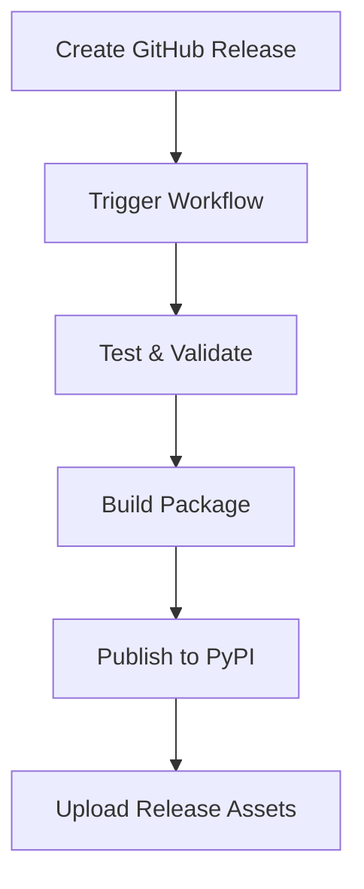

# PyPI Publishing Setup Guide 🚀

This guide will help you set up automated PyPI publishing for Storm Agent using GitHub Actions and PyPI's trusted publishing feature.

## 🔐 Setting Up PyPI Trusted Publishing

### Step 1: Create PyPI Account and Project

1. **Create a PyPI account** at [pypi.org](https://pypi.org) if you don't have one
2. **Verify your email address** and enable 2FA for security
3. **Reserve your project name** by uploading an initial version manually (optional but recommended)

### Step 2: Configure Trusted Publishing on PyPI

1. Go to your PyPI account settings: [pypi.org/manage/account/](https://pypi.org/manage/account/)
2. Click on "Publishing" in the left sidebar
3. Click "Add a new pending publisher"
4. Fill in the details:
   - **PyPI Project Name**: `storm-agent`
   - **Owner**: `MananShahTR` (your GitHub username)
   - **Repository name**: `custom-agent-framework`
   - **Workflow name**: `publish-to-pypi.yml`
   - **Environment name**: `pypi`
5. Click "Add"

### Step 3: Set Up GitHub Environment Protection

1. Go to your GitHub repository settings
2. Click on "Environments" in the left sidebar
3. Click "New environment" and name it `pypi`
4. Configure protection rules:
   - ✅ **Required reviewers**: Add yourself or trusted collaborators
   - ✅ **Wait timer**: Set to 5 minutes to prevent accidental releases
   - ✅ **Deployment branches**: Restrict to `main` branch only

5. Optionally create a `test-pypi` environment for testing:
   - Name: `test-pypi`
   - Same protection rules (optional for testing)

## 📦 How the Workflow Works

### Automatic Publishing Flow



### Workflow Jobs

1. **🧪 Test & Validate**
   - Tests on Python 3.9, 3.10, 3.11, 3.12
   - Validates package structure
   - Checks import paths in examples
   - Runs package validation script

2. **🏗️ Build Package**
   - Creates source distribution (`.tar.gz`)
   - Creates wheel distribution (`.whl`)
   - Validates distributions with `twine check`

3. **🚀 Publish to PyPI**
   - Uses trusted publishing (no API keys needed!)
   - Only runs on actual releases
   - Updates environment URL

4. **📎 Create Release Assets**
   - Attaches built distributions to GitHub release

## 🎯 How to Use

### Publishing a New Release

1. **Update version** in your package files:
   ```python
   # src/storm_agent/__init__.py
   __version__ = "1.1.0"
   ```

2. **Update CHANGELOG.md** with new features and changes

3. **Commit and push** your changes:
   ```bash
   git add .
   git commit -m "Prepare release v1.1.0"
   git push origin main
   ```

4. **Create a GitHub Release**:
   - Go to your repository on GitHub
   - Click "Releases" → "Create a new release"
   - Tag: `v1.1.0` (must start with 'v')
   - Title: `Storm Agent v1.1.0`
   - Description: Copy from CHANGELOG.md
   - Click "Publish release"

5. **Watch the magic happen!** 🪄
   - GitHub Actions will automatically run
   - Package will be tested, built, and published
   - Available on PyPI within minutes

### Testing with Test PyPI

To test the publishing process without affecting the main PyPI:

1. **Manual workflow trigger**:
   - Go to Actions → "🚀 Publish Storm Agent to PyPI"
   - Click "Run workflow"
   - Check "Publish to Test PyPI"
   - Click "Run workflow"

2. **Test installation**:
   ```bash
   pip install -i https://test.pypi.org/simple/ storm-agent
   ```

## 🔧 Workflow Features

### ✅ Comprehensive Testing
- Multi-Python version testing (3.9-3.12)
- Package structure validation
- Import path verification
- Distribution integrity checks

### 🛡️ Security Features
- Trusted publishing (no API keys in secrets)
- Environment protection rules
- Manual approval for releases
- Restricted to specific branches

### 🎛️ Manual Control
- Manual workflow dispatch for testing
- Test PyPI option for safe testing
- Environment-specific configurations

### 📊 Monitoring & Debugging
- Detailed logging at each step
- Artifact uploads for debugging
- Distribution verification
- Success/failure notifications

## 🐛 Troubleshooting

### Common Issues

1. **"Project does not exist" error**:
   - Make sure you've set up trusted publishing on PyPI
   - Verify the project name matches exactly (`storm-agent`)

2. **Environment not found**:
   - Create the `pypi` environment in GitHub settings
   - Add protection rules as described above

3. **Permission denied**:
   - Check that trusted publishing is configured correctly
   - Verify the GitHub repository and workflow details match

4. **Build failures**:
   - Check that `pyproject.toml` and `setup.py` are valid
   - Ensure all required files are present

### Getting Help

1. **Check workflow logs** in GitHub Actions tab
2. **Review PyPI publishing documentation**: [docs.pypi.org](https://docs.pypi.org)
3. **GitHub trusted publishing guide**: [docs.github.com](https://docs.github.com/en/actions/publishing-packages/publishing-python-packages-to-pypi)

## 🎉 Success!

Once set up, you'll have:
- ✅ Automated PyPI publishing on every release
- ✅ Multi-version testing before publishing  
- ✅ Secure, keyless authentication
- ✅ Professional release process
- ✅ Easy rollback and version management

Your Storm Agent package will be automatically available to users worldwide via:
```bash
pip install storm-agent
```

**Happy publishing! 🌩️⚡** 